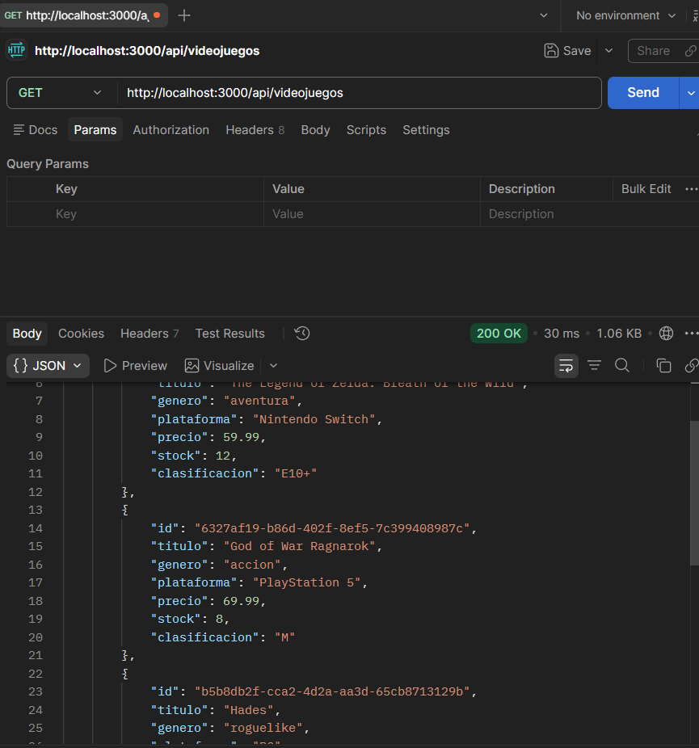
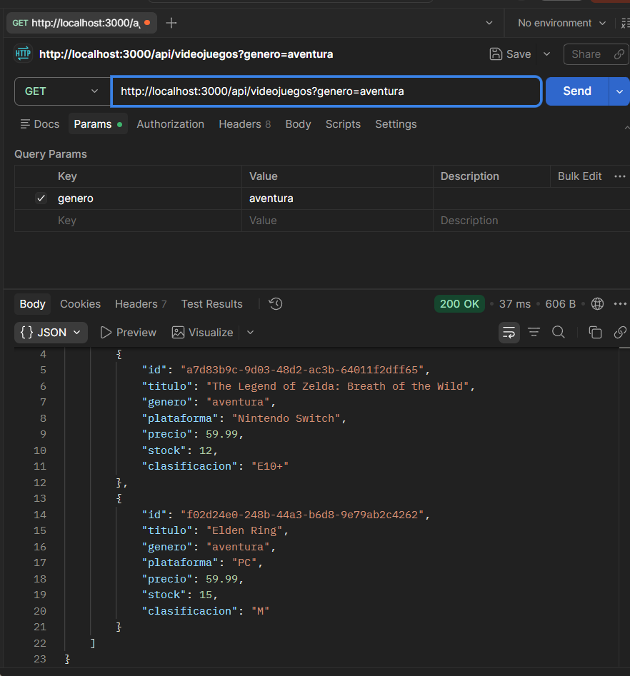
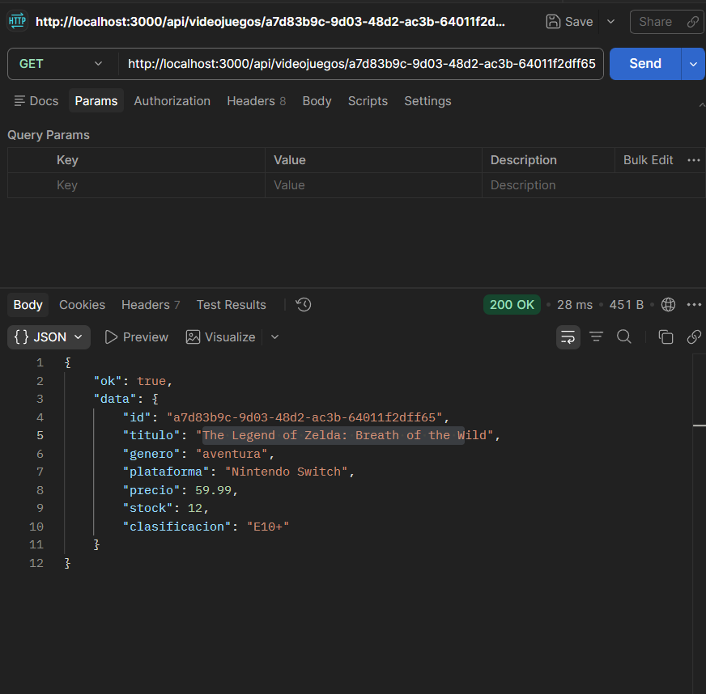
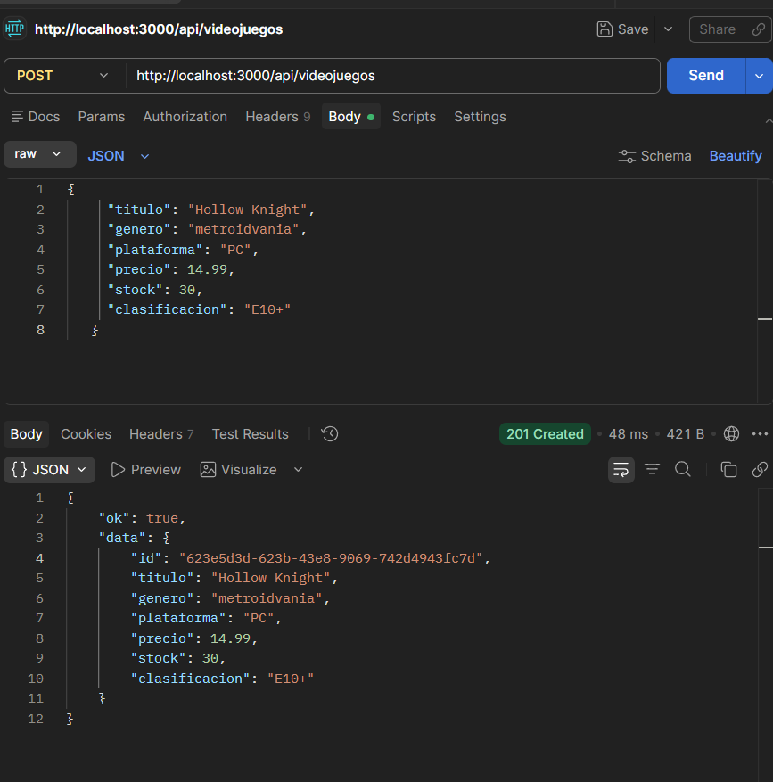
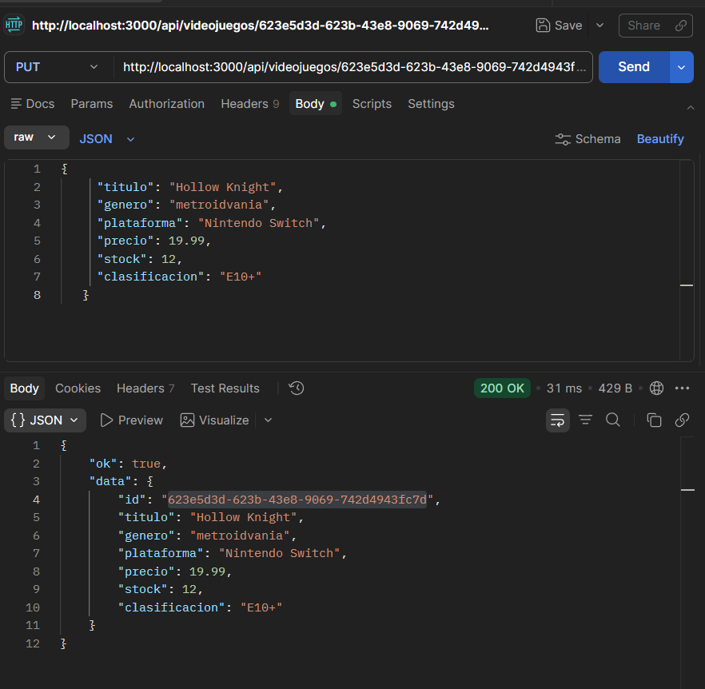
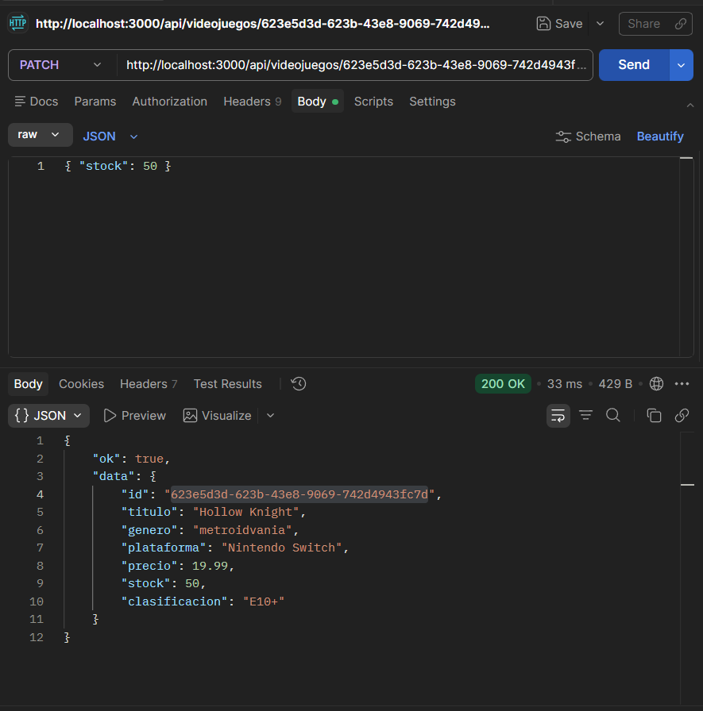
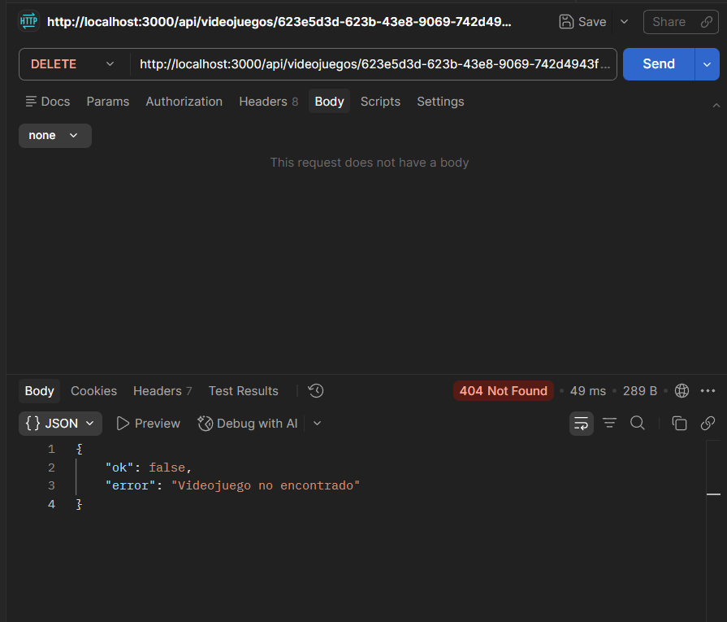
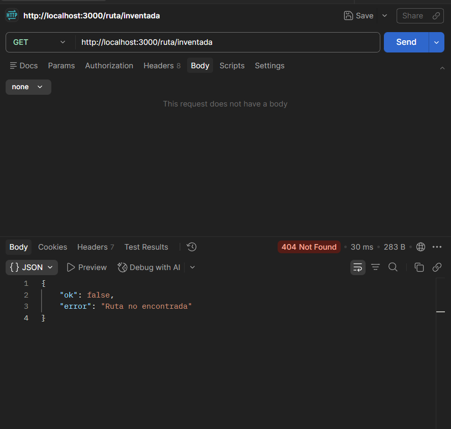
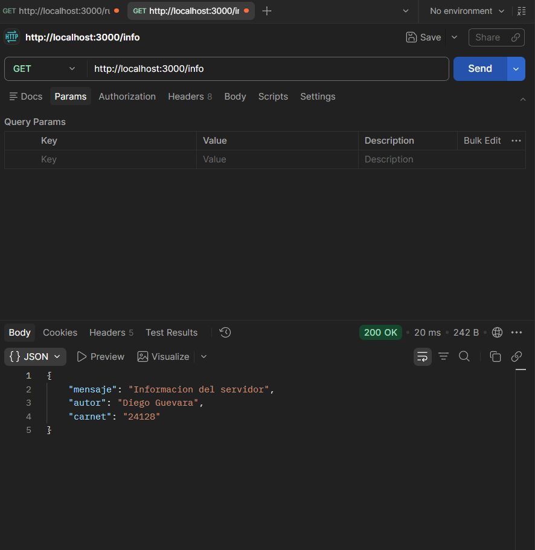

# Laboratorio 4 - API REST de Videojuegos

Proyecto del curso **Sistemas y Tecnologias Web**. Consiste en dos partes:
una correccion de un servidor HTTP nativo de Node.js y una API REST completa
construida con Express sobre el dominio de **videojuegos**.

## Integrantes

| Nombre          | Carnet |
|-----------------|--------|
| Diego Guevara   | 24128  |

---

## Requisitos

- Node.js 18 o superior (para `crypto.randomUUID` y `fs/promises`).
- npm.

## Instalacion

```bash
git clone https://github.com/YayaG2805/Lab4_SW_Diego.git
cd Lab4_SW_Diego
npm install
```

## Ejecucion

```bash
# Parte 1 - servidor nativo corregido
npm run corregido

# Parte 2 - API REST con Express
npm start
```

Ambos corren en `http://localhost:3000`. No los ejecutes al mismo tiempo.

---

## Parte 1 - Servidor nativo

- `servidor-malo.js`: archivo original con 6 errores. **No corre**, sirve solo
  como evidencia.
- `servidor-corregido.js`: version corregida y funcional.
- `datos.json`: archivo leido por la ruta `/api/videojuegos`.
- `SOLUCION.md`: documentacion detallada de cada error encontrado.

Rutas disponibles del servidor corregido:

- `GET /` -> texto plano "Servidor de videojuegos activo".
- `GET /info` -> JSON con datos del autor.
- `GET /api/videojuegos` -> contenido de `datos.json`.
- Cualquier otra ruta -> 404.

---

## Parte 2 - API REST con Express

Archivo principal: `app.js`. Ruta base: `/api/videojuegos`.

### Modelo de un videojuego

```json
{
  "id": "uuid-generado-automaticamente",
  "titulo": "Hades",
  "genero": "roguelike",
  "plataforma": "PC",
  "precio": 24.99,
  "stock": 25,
  "clasificacion": "T"
}
```

### Formato de respuesta

Todas las respuestas siguen el mismo formato:

- Exito: `{ "ok": true, "data": ... }`
- Error: `{ "ok": false, "error": "mensaje" }`

### Endpoints

| Metodo | Ruta                       | Descripcion                                  | Codigos       |
|--------|----------------------------|----------------------------------------------|---------------|
| GET    | `/`                        | Bienvenida e info del autor                  | 200           |
| GET    | `/api/videojuegos`         | Listar todos (acepta filtros)                | 200           |
| GET    | `/api/videojuegos/:id`     | Obtener uno por id                           | 200, 404      |
| POST   | `/api/videojuegos`         | Crear un nuevo videojuego                    | 201, 400      |
| PUT    | `/api/videojuegos/:id`     | Reemplazar todos los campos                  | 200, 400, 404 |
| PATCH  | `/api/videojuegos/:id`     | Actualizar campos parcialmente               | 200, 400, 404 |
| DELETE | `/api/videojuegos/:id`     | Eliminar un videojuego                       | 200, 404      |
| *      | cualquier otra ruta        | 404 con formato JSON                         | 404           |

### Filtros por query params

Soportados en `GET /api/videojuegos`:

- `genero` (ej. aventura, accion, roguelike, simulacion)
- `plataforma` (ej. PC, "PlayStation 5", "Nintendo Switch")
- `clasificacion` (ej. E, T, M, "E10+")

Se pueden combinar:

```
GET /api/videojuegos?genero=aventura
GET /api/videojuegos?plataforma=PC
GET /api/videojuegos?genero=aventura&plataforma=PC
```

### Ejemplo POST

`POST /api/videojuegos`

```json
{
  "titulo": "Hollow Knight",
  "genero": "metroidvania",
  "plataforma": "PC",
  "precio": 14.99,
  "stock": 30,
  "clasificacion": "E10+"
}
```

Respuesta esperada (201):

```json
{
  "ok": true,
  "data": {
    "id": "b5f1f6f4-...-...",
    "titulo": "Hollow Knight",
    "genero": "metroidvania",
    "plataforma": "PC",
    "precio": 14.99,
    "stock": 30,
    "clasificacion": "E10+"
  }
}
```

### Ejemplo PATCH (actualizar solo el stock)

`PATCH /api/videojuegos/<id>`

```json
{ "stock": 50 }
```

### Ejemplo PUT (reemplazo completo)

`PUT /api/videojuegos/<id>`

```json
{
  "titulo": "Hollow Knight",
  "genero": "metroidvania",
  "plataforma": "Nintendo Switch",
  "precio": 19.99,
  "stock": 12,
  "clasificacion": "E10+"
}
```

Si falta cualquier campo en un PUT o POST, la API responde 400 indicando los
campos faltantes.

---

## Capturas de pantalla

> Coloca aqui las capturas de Postman o navegador para cada endpoint.

### GET /api/videojuegos


### GET /api/videojuegos?genero=aventura


### GET /api/videojuegos/:id


### POST /api/videojuegos


### PUT /api/videojuegos/:id


### PATCH /api/videojuegos/:id


### DELETE /api/videojuegos/:id


### Ruta inexistente (404)


### Servidor nativo corregido (Parte 1)


---

## Estructura del proyecto

```
Lab4_SW_Diego/
├── .gitignore
├── README.md
├── SOLUCION.md
├── package.json
├── datos.json
├── servidor-malo.js
├── servidor-corregido.js
└── app.js
```